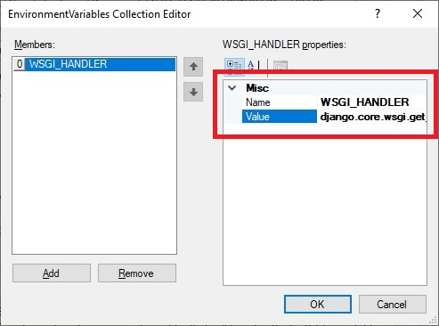
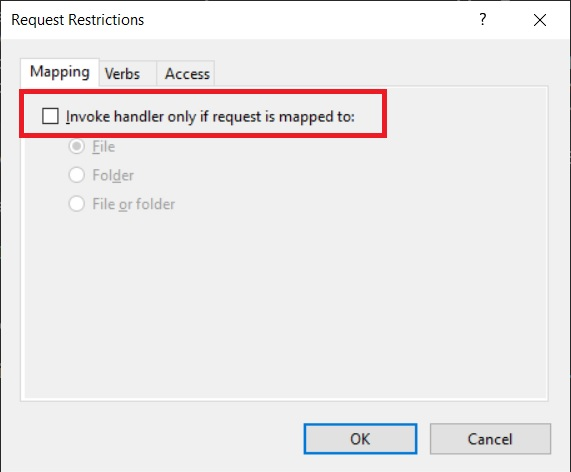

# KEEP Application Installation
### Table of Contents
1. [Introduction](#Introduction)
2. [Software Prerequisites](#SoftwarePrerequisites)
3. [Package Versions](#PackageVersions)
4. [Prerequisite Installation](#PrerequisiteInstallation)
5. [Building the Directory Structure](#DirectoryStructure)
6. [Installation From Scratch](#InstallFromScratch)
7. [Creating the Django Application](#CreateDjangoApp)
8. [Hosting KEEP App on IIS](#HostingKEEPAppIIS)
	1. [Prerequisites](#IISPrerequisites)
	2. [Prerequisite Installation](#IISPrerequisiteInstallation)
	3. [FastCGI Configuration](#FastCGIConfiguration)
	4. [Django Hostname Configuration](#DjangoHostnameConfiguration)
9. [Connecting KEEPApp to Jira](#ConnectKEEPAppJira)
	1.	[Prerequisites](#JiraPrerequisites)
	2.	[Connect the Django Backend](#ConnectDjangoBackend)

### <a id="Introduction">Introduction</a>
Below you will find the instructions on the installation of the Django backend application that comprises **KEEP App**. For the purpose of this tutorial all software and package prerequisites will be listed, and it will be assumed you are using the same versions. You may attempt installation using differing versions, but results may vary.

It will also be assumed you are using the same directory structure for the project as described below. You may attempt to use a different directory structure, but you will need to be able to modify file-paths accordingly.

**KEEP App** makes use of a **text classification neural network model** called `KEEPModel.pkl` trained using **KEEP Training**. The installation of **KEEP Training** is **not** necessarily required, but the `KEEPModel.pkl` text classification model **is** required.

For many of the installation steps you should be familiar with using a command shell (cmd prompt, PowerShell, Bash or equivalent), it will also be helpful to be familiar with Django and its file structure, though not required.

### <a id="SoftwarePrerequisites">Software Prerequisites</a>
1. [Python](https://www.python.org/downloads/) = 3.8.5
2. [Visual Studio Build Tools 2019](https://visualstudio.microsoft.com/downloads/) (C++ Build Tools)

### <a id="PackageVersions">Package Versions</a>
1. [Virtualenv](https://pypi.org/project/virtualenv/) = 20.0.31 (Allows the creation of python virtual environments)
1. [Pytorch](https://pytorch.org/get-started/locally/) = 1.6.0 (Contains data structures for multi-dimensional tensors and mathematical operations)
2. [TorchVision](https://pytorch.org/get-started/locally/) = 0.7.0 (Package of commonly used datasets, model architectures and image transformations for computer vision)
3. [Fastai](https://fastai1.fast.ai/install.html) = 1.0.61 (Simplified API for Pytorch)
4. [SpaCy](https://spacy.io/) = 2.3.2 (Natural language processing software library)
5. [Django](https://www.djangoproject.com/) = 2.1.10 (Python web framework)
6. [Wfastcgi](https://pypi.org/project/wfastcgi/) = 3.0.0 (Allows python applications to be hosted via Windows IIS)

### <a id="PrerequisiteInstallation">Prerequisite Installation</a>
Please refer to the [Prerequisite Installation](https://github.com/alechume/CGI_KEEPV1/blob/main/Documentation/PrerequisiteInstallation.md) guide for details

### <a id="DirectoryStructure">Building the Directory Structure</a>
**KEEP App's** directory structure will consist of a single **root** directory to act as a container, and 2 sub-directories, 1 containing the python virtual environment and 1 containing the Django folders and files.
1. Begin with the [Prerequisite Installation](https://github.com/alechume/CGI_KEEPV1/blob/main/Documentation/PrerequisiteInstallation.md)
2. Create a folder named `KEEPApp` that will act as our **root** directory
3. Inside the **root** directory, create a new folder named `src`, this will eventually contain our Django folders and files
4. Open your **command shell** and navigate to the inside of the **root** directory in your shell
> Note: Ensure your shell is running in administrator mode or equivalent
5. Create a `virtual python environment` to contain Python dependancies using the following command
> Note: A `virtual python environment` allows us to keep all our installed packages and dependancies local to the project we're working on, effectively allowing us to install different versions of packages for different projects without interference
```
virtualenv KEEPApp-env (You may replace KEEPApp-env with anything you'd like)
```
6. Your directory structure should now resemble the following:
```
└── KEEPApp            # Root directory
    ├── KEEPApp-env    # Virtual python environment
    └── src            # Django source folder
```
7. You are now ready to begin [Installation From Scratch](#InstallFromScratch)

### <a id="InstallFromScratch">Installation From Scratch</a>
1. Open your **command shell** and navigate to the inside of the **root** directory
2. Activate the virtual environment you created in order to start installing the required packages
> Note: You will need to activate this virtual environment every time you want to work with this project, you can deactivate the environment when finished with the `deactivate` command
```
.\KEEPApp-env\Scripts\activate
```
The output in your shell should now be prefaced with the environment name in brackets
```
(KEEPApp-env) C:\Some\path>
```
3. Before we begin installing the required packages we need to upgrade the pip installer with the following command
```
python -m pip install --upgrade pip
```
4. Now we are ready to begin installing our required packages. First we'll install Pytorch
> In general, it is best to install the same version of Pytorch that was used to train the model. If you are unsure which version was used, you will either need to find out, or attempt to install and correct version through trial and error. Please refer to the [Pytorch Installation](https://github.com/alechume/CGI_KEEPV1/blob/main/Documentation/PytorchInstallation.md) guide for details on how to install Pytorch.
5. Verify Pytorch installation by first entering a Python shell using the following command
```
python
```
and run the following commands
```
>>> from __future__ import print_function
>>> import torch
>>> x = torch.rand(5, 3)
>>> print(x)
```
The output should look similar to the follow:
```
tensor([[0.3380, 0.3845, 0.3217],
        [0.8337, 0.9050, 0.2650],
        [0.2979, 0.7141, 0.9069],
        [0.1449, 0.1132, 0.1375],
        [0.4675, 0.3947, 0.1426]])
```
Additionally, if you installed Pytorch with CUDA, you can check if your GPU driver and CUDA are installed and accessible using the following command, which should return `True`. **If you chose not to install Pytorch with CUDA, skip this step.**
```
torch.cuda.is_available()
```
Once verified we can exit our Python shell
```
>>> exit()
```
6. Install Fastai 1.0.61
```
pip install fastai==1.0.61
```
7. Install SpaCy 2.3.2
```
pip install spacy==2.3.2
```
8. Install Django 2.1.10
```
pip install django==2.1.10
```
9. Install wfastcgi 3.0.0
```
pip install wfastcgi==3.0.0
```
10. With the installation of the packages now complete, we can move on to the [Creating the Django Application](#CreateDjangoApp) section

### <a id="CreateDjangoApp">Creating the Django Application</a>
**KEEP App** is a Django application. Django is a web framework designed to allow the use of Python code to be used to handle http requests. We will be creating our Django application as a REST style API that can be connected to externally.
1. Open your **command shell** and navigate to the inside of the **root** directory
2. Activate the virtual environment you created
```
.\KEEPApp-env\Scripts\activate
```
3. Create the main Django project with the following command
> Note: This command will create a manage.py file and a subfolder with the same name as your project-name within the `src` folder. Take note of the location of the manage.py file, as this will be needed for a number of commands later
```
django-admin startproject keepapi src (You may replace keepapi with anything you'd like)
```
4. In your shell, navigate to the inside of the `src` folder
```
cd src
```
5. Most Django applications are broken up into smaller chunks called **Apps**, we will use the same principle with KEEP by creating a **keep** app within our Django project. We can do this with the following command
```
django-admin startapp keep (You may replace keep with anything you'd like)
```
6. If you navigate to the `src` folder using your file-system, you should see a file structure that resembles the following:


7. Inside the `keep` folder, you should see the following files:


8. Inside the `keepapi` folder, you should see the following files:


9. Inside the `keep` folder, open the `views.py` file using your favorite text editor and replace the contents with the following:
```Python
from django.views.decorators.http import require_POST
from django.views.decorators.csrf import csrf_exempt
from django.http import JsonResponse
from fastai.basic_train import load_learner
from torch import argmax
import os

model = load_learner(os.path.dirname(os.path.abspath(__file__)),'models/KEEPModel.pkl')

#POST requests to /model/ are fed into the model and returns the reponse.
#
@require_POST
@csrf_exempt
def predict(request):
	if request.method == 'POST':
		pred = argmax(model.predict(request.POST.get('details'))[2])
		return JsonResponse(int(pred), safe=False)
```
10. Inside the `keep` folder, create a new **python file** named `urls.py` and fill it with the following:
```Python
from django.urls import path

from .views import predict

urlpatterns = [
	path('', predict, name='predict'),
]
```
11. Inside the `keep` folder, create a new **folder** named `models`. Copy the **text classification model** named `KEEPModel.pkl` into this folder. This model was generated by **KEEP Training**, refer to the [KEEP Training Operation Manual](https://github.com/alechume/CGI_KEEPV1/blob/main/Documentation/KEEPTrainingOperationManual.md) for details on how to create and find this file
12. Inside the `keepapi` folder, open the `settings.py` file using your favorite text editor. Find the `INSTALLED_APPS` section and include the **app** we created during step 5 like so:
```Python
INSTALLED_APPS = [
    'django.contrib.admin',
    'django.contrib.auth',
    'django.contrib.contenttypes',
    'django.contrib.sessions',
    'django.contrib.messages',
    'django.contrib.staticfiles',

    #Custom Apps
    'keep', # Replace keep with your specific app name (if you chose something different)
]
```
13. Inside the `keepapi` folder, open the `urls.py` file using your favorite text editor and replace the contents with the following:
```Python
from django.contrib import admin
from django.urls import path
from django.conf.urls import include

urlpatterns = [
    path('keepapp/admin/', admin.site.urls),
    path('keepapp/model/', include('keep.urls')), # Replace keep with your specific app name (if you chose something different)
]
```
14. Ensure all files have been saved
15. In your **command shell** navigate to the inside of the `src` folder
16. Start the **Django development server** with the following command
> Note: The Django development server is a basic web-server not suitable for production deployment. In this instance we will be using it to test basic configuration only
```
python manage.py runserver
```
When the django development server has successfully started you should see output similar to the following:
> Note: By default the Django development server runs on port 8000. If you need to use a different port, you can specify a URL and port combination for Django to use by modifying the runserver command. Example: `python manage.py runserver 127.0.0.1:85` would start the server using port 85
```
System check identified no issues (0 silenced).
October 27, 2020 - 15:24:04
Django version 2.1.10, using settings 'keepapi.settings'
Starting development server at http://127.0.0.1:8000/
Quit the server with CTRL-BREAK.
```
17. Navigate to http://127.0.0.1:8000/keepapp/model/ you should be presented with a `405 error`. This indicates that you have successfully reached the django view, but since the view only accepts POST requests there is nothing to actually display.


18. The Django server is now successfully installed and configured for local use, we are now ready to move on to the [Hosting KEEP App on IIS](#HostingKEEPAppIIS) section

### <a id="HostingKEEPAppIIS">Hosting KEEP App on IIS</a>
We will configure **KEEP App** to run as a **sub-application** of the default Windows IIS website. The main advantage here is that we'll be able to access **KEEP App** from the same hostname as the default website.

#### <a id="IISPrerequisites">Prerequisites</a>
1. [Windows IIS (Internet Information Services)](https://www.iis.net/) = 10.0
2. [Common Gateway Interface (CGI) for IIS](https://docs.microsoft.com/en-us/iis/configuration/system.webserver/cgi)

#### <a id="IISPrerequisiteInstallation">Prerequisite Installation</a>
We'll begin by installing **Windows IIS** (Internet Information Services) with **CGI** enabled.
1. Install Windows IIS (Internet Information Services) with CGI
	1. Open **Control Panel**
	2. In the **Control Panel** search box, type **windows features**
	3. Under **Programs and Features**, click **Turn Windows features on or off**

	

	4. Check the box next to **Internet Information Services** and expand **World Wide Web Services** and **Application Development Features** menus. Check the box next to **CGI**

	

	5. Navigate to http://localhost/ in a browser. You should see the default Windows IIS landing page. **If you do not see the default landing page**
		1. Open **Control Panel**
		2. In the search box type **services**
		3. Under **Administrative Tools** click **View local services**
		4. Scroll down the list of services until you find **World Wide Web Publishing Service**
		5. Ensure the service is running, if not right-click and select **Start**

#### <a id="FastCGIConfiguration">FastCGI Configuration</a>
With the prerequisite installation complete, we can now configure the **FastCGI** settings required to serve Django through IIS. We'll do this by first creating our **FastCGI** application for **KEEP App** and then creating a **sub-application** with a proper **Handler** to process requests to **KEEP App's** Django backend.
1. Create the FastCGI application
	1. From the **Windows start menu**, search for **IIS Manager**
	2. In **IIS Manager**, click the **FastCGI Settings** icon

	

	3. In the right-side **Actions** menu, click **Add Application...**
	4. In the **Full Path:** field, enter the path to the `python.exe` file of the **virtual environment** for **KEEP App**. For example: `path\to\KEEPApp\KEEPApp-env\Scripts\python.exe`
	5. In the **Arugments:** field, enter the path to the `wfastcgi.py` file of the **virtual environment** for **KEEP App**. For example: `path\to\KEEPApp\KEEPApp-env\Lib\site-packages\wfastcgi.py`

	

	6. In the **FastCGI Properties:** section, click on **Environment Variables** and then click the <kbd>...</kbd> button on the right. This will open the **EnvironmentVariables Collection Editor**

	

	7. Click **Add**
	8. In the right-side section, change **Name** to **WSGI_HANDLER**, exactly as shown
	9. In the right-side section, change **Value** to **django.core.wsgi.get_wsgi_application()**, exactly as shown

	

	10. Click **Add** again
	11. In the right-side section, change **Name** to **DJANGO_SETTINGS_MODULE**, exactly as shown
	12. In the right-side section, change **Value** to **keepapi.settings**, exactly as shown
	> Note: If you named your Django project something else, you will need to replace `keepapi` with whatever name you chose.

	

	13. Click **OK** to close the **EnvironmentVariables Collection Editor**
	14. Click **OK** again, to close the **Add FastCGI Application** screen
	15. You should now see your new **FastCGI** application listed on the **FastCGI Settings** screen

	

2. Add a sub-application to the default website
	1. In the left-side **Connections** menu, expand the **server** and **Sites** folder
	2. Right-click the **Default Web Site** and select **Add Application**

	
	
	3. In the **Add Application** screen, enter `KEEPApp` as the **Alias**
	4. In the **Physical path:** field, enter the path to the `src` folder located in the **root** directory we made during installation

	

	5. Click **OK**, you should now see the new **sub-application** in the left-side **Connections** menu

	

3. Configure site handler mappings
	1. Select the new **sub-application** you created in the previous step
	2. Click the **Handler Mappings** icon
	
	

	3. In the right-side **Actions** menu, click **Add Module Mapping...**
	4. Enter `*` in the **Request path:** field
	5. Select `FastCgiModule` in the **Module:** field
	6. Enter the path to the `python.exe` of the **virtual environment**, followed by a pipe `|` symbol, immediately followed by the path to the `wfastcgi.py` file of the **virtual environment**. For example:
	> Note: Having any spaces in any part of the path is not supported with this method
	```
	C:\path\to\KEEPApp\KEEPApp-env\Scripts\python.exe|C:\path\to\KEEPApp\KEEPApp-env\Lib\site-packages\wfastcgi.py
	```
	7. Enter `Django Handler` in the **Name:** field

	

	8. Click **Request Restrictions**
	9. **Un-check** the box next to **Invoke handler only if request is mapped to:**

	

	10. Click **OK** to close the **Request Restrictions** screen
	11. Click **OK** to close the **Add Module Mapping** screen
	12. Click **No** to the **Do you want to create a FastCGI application for this executable?** warning
4. Configure folder permissions for IIS
	1. Navigate to the **root** folder of the **KEEP App** project
	2. Right-click the **root** folder and select **Properties**
	3. Click the **Security** tab

	
	
	4. Under the **Group or user names:** section, check for **IUSR** and **IIS_USRS**. **If IUSR and IIS_IUSRS do not exist** performing the following steps:
		1. Under **Group or user names:** section, click **Edit...**

		

		2. Under **Group or user names:** in the new window, click **Add...**
		3. In the **Select Users or Groups** screen, click **Locations...** and select the first item in the list

		

		4. Click **OK** to close the **Locations** screen
		5. Enter `IUSR; IIS_IUSRS` in the **Enter the object names to select:** field and click **Check Names**

		

		6. Click **OK** to close the **Select Users or Groups** screen
		7. Click **OK** again, to close the **Permissions** screen
		8. You should now see **IUSR** and **IIS_IUSRS** listed in the **Security** tab of the **Properties** screen
		9. **OPTIONAL** If your **root** directory resides somewhere on the file system where higher-level permissions are likely to overwrite the permissions we just configured, for example, in a user's home directory, you can disable inheritance.
			1. From the **Security** tab of the **Properties** screen, click **Advanced**
			2. In the **Advanced Security Settings** screen, click **Disable inheritance**

			

			3. Click **Convert inherited permissions into explicit permissions on this object** on the **Block Inheritance** warning
	
			

			4. Click **OK** to close the **Advanced Security Settings** screen
	5. Click **OK** to close the **Properties** screen
	> Note: We have only added **Read** and **Execute** permissions. For certain Django projects, it may be necessary to add **Write** and **Modify** permissions to **IUSR** and **IIS_IUSRS** as well
	6. You should now be able to access **KEEP App** through IIS at http://localhost/keepapp/model/ in your browser. Replace `/keepapp/` with whatever you chose as an **Alias** during the creation of the **sub-application**
	7. If you would like to configure **KEEP App** to be accessible from a **custom hostname** instead of just **localhost**, continue on to the [Django Hostname Configuration](#DjangoHostnameConfiguration) section
	> Note: KEEP App has no static files, therefore static file configuration has been intentionally skipped
	8. If you do not need **KEEP App** to be accessible from a **custom hostname** you can move on to [Connecting KEEPApp to Jira](#ConnectKEEPAppJira)

#### <a id="DjangoHostnameConfiguration">Django Hostname Configuration</a>
Django includes a security feature that only allows it to be accessed from certain **allowed hosts**. **Localhost** is included by default **so long as nothing else is specified**. If your **default IIS website** has a custom hostname binding, we can add that hostname to our Django `settings.py` to allow it to be used. For the purpose of this example we will be using `www.myexamplehostname.com` as our custom hostname, you would need to substitute this for your specific hostname.
1. Open the `settings.py` file of your main Django project in your favorite text editor. This file is located in the `root\src\project` folder. For example, `KEEPApp\src\keepapi`
2. Modify the `ALLOWED_HOSTS` section to include your custom hostname
> Note: If you would like to retain the ability to access the Django backend via **localhost**, you must also explicitly include `localhost` in the `ALLOWED_HOSTS` as well


3. You should now be able to access **KEEP App** through IIS at http://www.myexamplehostname.com/keepapp/model/ or http://localhost/keepapp/model/ in your browser. Replace `/keepapp/` with whatever you chose as an **Alias** during the creation of the **sub-application**
> Note: This guide does not including DNS configuration. It is assumed that if you are using a custom hostname for your default IIS website, you have already configured your DNS properly
4. The last step is to connect the **Jira custom plugin** to our Django backend. Refer to the [Connecting KEEPApp to Jira](#ConnectKEEPAppJira) section for details.

### <a id="ConnectKEEPAppJira">Connecting KEEPApp to Jira</a>
**KEEP App** works by making predictions on the quality of **Jira issues**. A custom plugin has been developed that will automatically detect when a **Jira issue** is created or updated and send the required data to the **KEEP App** Django backend. The Django backend returns a response with the predicted quality and the Jira plugin displays that information on the **Jira issue**.

#### <a id="JiraPrerequisites">Prerequisites</a>
1. A Jira instance to connect to
2. The custom Jira plugin for KEEP is already installed
3. The hostname/url of the Django backend instance

#### <a id="ConnectDjangoBackend">Connect the Django Backend</a>
1. Log in to **Jira**
2. Navigate to the **Add-ons Marketplace**


3. In the left-side menu, click **Manage apps**


4. Scroll down the list of **User-installed apps** until you find **Knowledge Enhancement and Evaluation Project**


5. Expand **Knowledge Enhancement and Evaluation Project** and click on the **modules list** to see the enabled/disabled modules. Ensure the **Quality Servlet** module is disabled


6. Click **Configure**


7. Enter the address of the Django backend server in the **Assessment URL** field and click **Save**


8. To test functionality, modify the **Description** field of a **Jira issue**. You should see an indication of the quality shown below the **Description** field


