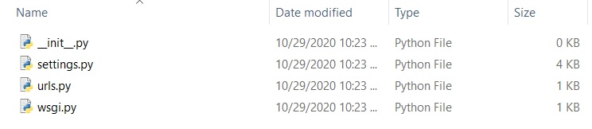

# KEEP Application Installation
### Table of Contents
1. [Introduction](#Introduction)
2. [Software Prerequisites](#SoftwarePrerequisites)
3. [Package Versions](#PackageVersions)
4. [Prerequisite Installation](#PrerequisiteInstallation)
5. [Installation From Scratch](#InstallFromScratch)
6. [Installation From Repository](#InstallFromRepository)
7. [How to Install Pytorch](#InstallPytorch)
8. [Creating the Django Application](#CreateDjangoApp)
9. [Hosting Django on IIS](#HostingDjangoIIS)
10. [Connecting KEEPApp to Jira](#ConnectKEEPAppJira)

### <a id="Introduction">Introduction</a>
Below you will find the instructions on the installation of the Django backend application responsible for using the model trained with KEEP Training. The installation of KEEP Training is NOT required, but a trained text classification model IS required. For the purpose of this tutorial all software and package prerequisites will be listed, and it will be assumed you are using the same versions. You may attempt installation using differing versions, but results may vary.

For many of the installation steps you should be familiar with using a command shell (CMD, PowerShell, Bash or equivalent). It will also be helpful to be familiar with Django application structure and files, though not required.

### <a id="SoftwarePrerequisites">Software Prerequisites</a>
1. [Python](https://www.python.org/downloads/) = 3.8.5
2. [Visual Studio Build Tools 2019](https://visualstudio.microsoft.com/downloads/) (C++ Build Tools)

### <a id="PackageVersions">Package Versions</a>
1. [Virtualenv](https://pypi.org/project/virtualenv/) = 20.0.31 (Allows the creation of python virtual environments)
1. [Pytorch](https://pytorch.org/get-started/locally/) = 1.6.0 (Contains data structures for multi-dimensional tensors and mathematical operations)
2. [TorchVision](https://pytorch.org/get-started/locally/) = 0.7.0 (Package of commonly used datasets, model architectures and image transformations for computer vision)
3. [Fastai](https://fastai1.fast.ai/install.html) = 1.0.61 (Simplified API for Pytorch)
4. [SpaCy](https://spacy.io/) = 2.3.2 (Natural language processing software library)
5. [Django](https://www.djangoproject.com/) = 2.1.10 (Django web framework used for handling prediction requests and returning results)
6. **OPTIONAL** [Wfastcgi](https://pypi.org/project/wfastcgi/) = 3.0.0 (Allows python applications to be hosted via Windows IIS)

### <a id="PrerequisiteInstallation">Prerequisite Installation</a>
1. Download and install `Python` (version 3.8.5), be sure to check your system information to determine if you need 64bit vs 32bit
	1. Go to https://www.python.org/downloads/
	2. Include pip during installation
	3. Add Python to your environment variables
	4. Type `python -V` in cmd prompt, powershell, bash shell or equivalent to verify Python installation

	```
	Python 3.8.5
	```
2. Download and install `Visual Studio Build Tools 2019 (C++ Build Tools)`
	1. Go to https://visualstudio.microsoft.com/downloads/
	2. Scroll down to **All Downloads**
	3. Click the dropdown for **Tools for Visual Studio 2019**
	4. Download **Build Tools for Visual Studio 2019**
	5. Run the build tools installer you just downloaded and follow the prompts until you reach the installation details screen
	> NOTE: If you have already installed Visual Studio build tools in the past, you will first need to click **Modify** when you reach the **Installed** screen 
	6. Check the box for **C++ build tools**, all other options can remain default.
	
	7. Click install
3. With the prerequisite installation complete, you on move on to installing KEEP App via one of the following methods:
	* [Installation From Scratch](#InstallFromScratch)
	* [Installation From Repository](#InstallFromRepository)

### <a id="InstallFromScratch">Installation From Scratch</a>
1. Begin with the [Prerequisite Installation](#PrerequisiteInstallation)
2. Create a folder to act as the root directory for KEEP and navigate to this folder in your shell
> Note: Ensure your shell is running in administrator mode or equivalent
```
cd path/to/folder
```
3. Install `virtualenv` using pip
```
pip install virtualenv
```
4. Create a `virtual python environment` to contain Python dependancies using the following command
> Note: A `virtual python environment` allows us to keep all our installed packages and dependancies local to the project we're working on, effectively allowing us to install different versions of packages for different projects without interference.
```
virtualenv ENVName-env (Replace ENVName-env with anything you'd like)
```
5. Activate the virtual environment you just created in order to start installing required packages
> Note: You will need to activate this virtual environment every time you want to work with this project from the cmd line or shell, you can deactive the environment when finished with the `deactivate` command.
```
.\ENVName-env\Scripts\activate
```
The output in the shell window should now be prefaced with the environment name in brackets:
```
(ENVName-env) C:\Some\path>
```
6. Before we begin installing the required packages we need to upgrade the pip installer with the following command
```
python -m pip install --upgrade pip
```
7. Now we are ready to begin installing our required packages. First we'll install Pytorch
> In general it is best to install the same version of Pytorch that was used to train the model. If you are unsure which version was used, you will either need to find out, or attempt to install the correct version through trial and error. Please refer to the [How to Install Pytorch](#InstallPytorch) section of this installation guide for details
8. Verify Pytorch installation by first entering a Python shell using the following command
```
python
```
and run the following commands
```
>>> from __future__ import print_function
>>> import torch
>>> x = torch.rand(5, 3)
>>> print(x)
```
The output should look similar to the follow:
```
tensor([[0.3380, 0.3845, 0.3217],
        [0.8337, 0.9050, 0.2650],
        [0.2979, 0.7141, 0.9069],
        [0.1449, 0.1132, 0.1375],
        [0.4675, 0.3947, 0.1426]])
```
Additionally, if you installed Pytorch with CUDA, you can check if your GPU driver and CUDA are installed and accessible using the following command, which should return `True`. **If you chose not to install Pytorch with CUDA, skip this step.**
```
torch.cuda.is_available()
```
Once verified we can exit our Python shell
```
>>> exit()
```
9. Install Fastai 1.0.61 **(with your python virtual environment activated)**
```
pip install fastai==1.0.61
```
10. Install SpaCy 2.3.2 **(with your python virtual environment activated)**
```
pip install spacy==2.3.2
```
11. Install Django 2.1.10 **(with your python virtual environment activated)**
```
pip install django==2.1.10
```
12. **OPTIONAL** If you intend to host the KEEP App using **Windows IIS** you will need to install wfastcgi 3.0.0
```
pip install wfastcgi==3.0.0
```
13. The KEEP App package requirements are now successfully installed, you can now move on to creating the Django application backend for KEEP App.
> Please refer to the [Creating the Django Application](#CreateDjangoApp) section of this installation guide for details.

### <a id="InstallFromRepository">Installation From Repository</a>
1. Begin with the [Prerequisite Installation](#PrerequisiteInstallation)
2. Clone the repository to your local environment and navigate to the `KEEPApp` folder via your shell
> Note: Ensure your shell is running in administrator mode or equivalent
```
cd path/to/folder/KEEPApp/
```
3. Install `virtualenv` using pip
```
pip install virtualenv
```
4. Create a `virtual python environment` to contain Python dependancies using the following command
> Note: A `virtual python environment` allows us to keep all our installed packages and dependancies local to the project we're working on, effectively allowing us to install different versions of packages for different projects without interference.
```
virtualenv ENVName-env (Replace ENVName-env with anything you'd like)
```
5. Activate the virtual environment you just created in order to start installing required packages
> Note: You will need to activate this virtual environment every time you want to work with this project from the cmd line or shell, you can deactive the environment when finished with the `deactivate` command.
```
.\ENVName-env\Scripts\activate
```
The output in the shell window should now be prefaced with the environment name in brackets:
```
(ENVName-env) C:\Some\path>
```
6. Before we begin installing the required packages we need to upgrade the pip installer with the following command
```
python -m pip install --upgrade pip
```
7. Now we are ready to begin installing our required packages. First we'll install Pytorch
> In general it is best to install the same version of Pytorch that was used to train the model. If you are unsure which version was used, you will either need to find out, or attempt to install the correct version through trial and error. Please refer to the [How to Install Pytorch](#InstallPytorch) section of this installation guide for details
8. Verify Pytorch installation by first entering a Python shell using the following command
```
python
```
and run the following commands
```
>>> from __future__ import print_function
>>> import torch
>>> x = torch.rand(5, 3)
>>> print(x)
```
The output should look similar to the follow:
```
tensor([[0.3380, 0.3845, 0.3217],
        [0.8337, 0.9050, 0.2650],
        [0.2979, 0.7141, 0.9069],
        [0.1449, 0.1132, 0.1375],
        [0.4675, 0.3947, 0.1426]])
```
Additionally, if you installed Pytorch with CUDA, you can check if your GPU driver and CUDA are installed and accessible using the following command, which should return `True`. **If you chose not to install Pytorch with CUDA, skip this step.**
```
torch.cuda.is_available()
```
Once verified we can exit our Python shell
```
>>> exit()
```
9. Install the remaining packages using the included `requirements.txt` file
> NOTE: You will need to navigate to the same directory as the requirements file, or specify the exact location. The requirements file is located in the `KEEPApp` folder of the repository
```
pip install -r requirements.txt
```
10. The KEEP App package requirements are now successfully installed. We can now move on to testing base operation of the Django project
11. Navigate to the `src` folder in your shell, located in the root of the `KEEPApp` project
```
cd src
```
12. Run the following commands from the `src` folder (the same folder where manage.py is located)
```
python manage.py makemigrations
python manage.py migrate
```
13. Using the file-system (not the shell) navigate to the `keep` folder inside the `src` folder
14. Create a new folder named `models` and copy the `KEEPModel.pkl` file that was trained using KEEP Training into this folder
15. From your shell, which should still be running from the `src` (folder which contains `manage.py`), run the following command to start the development server
```
python manage.py runserver
```
When the django development server has successfully started you should see output similar to the following:
```
System check identified no issues (0 silenced).
October 27, 2020 - 15:24:04
Django version 2.1.10, using settings 'keepapi.settings'
Starting development server at http://127.0.0.1:8000/
Quit the server with CTRL-BREAK.
```
16. Navigate to `http://127.0.0.1:8000/model/` in your browser, you should be presented with a `405 error`. This indicates that you have successfully reached the django view, but since the view only accepts POST requests there is nothing to actually display.
17. With the Django server successfully installed and configured, you are now ready to move on to [Hosting Django on IIS](#HostingDjangoIIS)

### <a id="InstallPytorch">How to Install Pytorch</a>
For Pytorch installation with CUDA, you will be required to know which model of GPU the machine or server running KEEP has. If you are unsure, or do not have a CUDA capable GPU you may skip to step 3.
1. Determine if you have a CUDA capable GPU
	1. Navigate to https://developer.nvidia.com/cuda-gpus
	2. Scroll down and check the expandable tables for your specific GPU model
	3. Make note of the **Compute Capability** number next to your GPU model
	4. If you determine you do not have a CUDA capable GPU, skip to step 3
2. Determine which CUDA SDK to use
	1. Navigate to https://pytorch.org/get-started/locally/
	2. Make note of the Pytorch supported CUDA SDK's
	
	3. Navigate to https://en.wikipedia.org/wiki/CUDA#GPUs_supported
	4. Find the Pytorch supported SDK's in the list and cross-reference with the **Compute Capability** number from step 1 to determine which SDK to use, generally the higher the SDK the better
	> NOTE: This guide was tested using CUDA SDK 10.2, with Pytorch version 1.6.0
	5. Navigate to https://developer.nvidia.com/cuda-toolkit-archive and download and install the CUDA Toolkit with the matching number of the SDK you just determined, for example, if you determined you need to use CUDA SDK 10.2, download CUDA Toolkit 10.2. When downloading choose **exe (local)**.
3. Install Pytorch
	1. Navigate to https://pytorch.org/get-started/locally/
	2. Select the following options:
		1. Pytorch Build: Stable
		2. Your OS: What operating system KEEP will be running on
		3. Package: Pip
		4. Language: Python
		5. CUDA: The SDK number you determined in step 2, or None
		
	3. Copy the output from **Run this Command** and run the command in your shell **while the virtual environment is activated**
	> NOTE: If you get an error during the running of this command about SSL certificates, you can modify the command to use Amazon AWS instead and try again. For example: 
	```
	pip install torch==1.6.0+cpu torchvision==0.7.0+cpu -f https://download.pytorch.org/whl/torch_stable.html
	```
	> would become: 
	```
	pip install torch==1.6.0+cpu torchvision==0.7.0+cpu -f https://s3.amazonaws.com/pytorch/whl/torch_stable.html
	```

### <a id="CreateDjangoApp">Creating the Django Application</a>
1. From the root directory of the KEEP App project, create a new folder called `src` to keep the Django application files contained
2. From your shell, navigate to the root directory of the KEEP App project
```
cd path/to/folder
```
3. Activate the KEEP App virtual environment
```
.\ENVName-env\Scripts\activate (Replace ENVName-env with the name of the KEEP App virtual environment)
```
4. Create the main Django application inside the `src` folder by using the following command
> NOTE: This command will create a manage.py file and a subfolder with the same name as your project-name within the src folder. Take note of the location of the manage.py file, as this will be used for a number of commands later.
```
django-admin startproject project-name src (Replace project-name with whatever you'd like)
```
5. In your shell, navigate to the `src` folder you created
```
cd src
```
6. Most Django applications are broken up into smaller pieces called Apps, we will use the same principle with KEEP by creating a keep app within our Django project. From the `src` folder run the following command
```
django-admin startapp app-name (Replace app-name with anything you'd like i.e. keep)
```
7. Navigate to the `src` folder using the file-system. In the src folder you should see a similar structure:

8. Open the folder with the name that matches whatever app-name you set previously, it should look like the following:

9. Using your favorite text editor, open the `views.py` file and replace the contents with the following:
```Python
	from django.views.decorators.http import require_POST
	from django.views.decorators.csrf import csrf_exempt
	from django.http import JsonResponse
	from fastai.basic_train import load_learner
	from torch import argmax
	import os

	model = load_learner(os.path.dirname(os.path.abspath(__file__)),'models/KEEPModel.pkl')

	#POST requests to /model/ are fed into the model and returns the reponse.
	#
	@require_POST
	@csrf_exempt
	def predict(request):
		if request.method == 'POST':
			pred = argmax(model.predict(request.POST.get('details'))[2])
			return JsonResponse(int(pred), safe=False)

		# if request.method == 'GET':
		# 	pred = argmax(model.predict('This is some random text to use as an example for prediction')[2])
		# 	return JsonResponse(int(pred), safe=False)
```
10. Create a new file named `urls.py` and fill it with the following:
```Python
	from django.urls import path

	from .views import predict

	urlpatterns = [
		path('', predict, name='predict'),
	]
```
11. Create a new folder named `models` and copy the `KEEPModel.pkl` file that was trained using KEEP Training into this folder
12. Return to the `src` folder and navigate to the folder matching the project-name you set previously (Not the app-name). The folder should contain the following files:

13. Modify the `settings.py` file `INSTALLED_APPS` section to match the following:
```Python
	INSTALLED_APPS = [
	    'django.contrib.admin',
	    'django.contrib.auth',
	    'django.contrib.contenttypes',
	    'django.contrib.sessions',
	    'django.contrib.messages',
	    'django.contrib.staticfiles',

	    #Custom Apps
	    'app-name', # Replace app-name with your specific app name
	]
```
14. Modify the `urls.py` file to match the following:
```Python
	from django.contrib import admin
	from django.urls import path
	from django.conf.urls import include

	urlpatterns = [
	    path('admin/', admin.site.urls),
	    path('model/', include('app-name.urls')), # Replace app-name with your specific app name
	]
```
15. Ensure all file modifications are saved
16. With your shell, navigate to the `src` folder which contains the `manage.py` file and run the following command
```
python manage.py runserver
```
When the django development server has successfully started you should see output similar to the following:
```
System check identified no issues (0 silenced).
October 27, 2020 - 15:24:04
Django version 2.1.10, using settings 'keepapi.settings'
Starting development server at http://127.0.0.1:8000/
Quit the server with CTRL-BREAK.
```
17. Navigate to `http://127.0.0.1:8000/model/` you should be presented with a `405 error`. This indicates that you have successfully reached the django view, but since the view only accepts POST requests there is nothing to actually display.
18. With the Django server successfully installed and configured, you are now ready to move on to [Hosting Django on IIS](#HostingDjangoIIS)

### <a id="HostingDjangoIIS">Hosting Django on IIS</a>
1. Begin with either [Installation From Scratch](#InstallFromScratch) or [Installation From Repository](#InstallFromRepository). If you installed from scratch ensure you also installed the optional `wfastcgi` package
2. Install Windows IIS (Internet Information Services)
	1. Open Control Panel
	2. In the Control Panel search box, type **windows features**
	3. Under **Programs and Features** click **Turn Windows features on or off**
	4. Check the box next to **Internet Information Services** and expland the World Wide Web Services and Application Development Features menus. Check the box next to **CGI**
	
	5. Navigate to http://localhost in a browser, you should see the default Windows IIS landing page
		1. If you don't see the default page
		2. Go back to Control Panel
		3. In the search box type **services**
		4. Under **Administrative Tools** click **View local services**
		5. Scroll down the list of services until you find **World Wide Web Publishing Service**
		6. Ensure this service is running, if not right click on it and select **Start**
3. Configure FastCGI in IIS
	1. From the Windows start menu, search for IIS Manager
	2. From the menu on the left, select the server

	
	3. With the server still selected, double-click the **FastCGI Settings** icon in the middle area
	4. In the menu on the right, click **Add Application...**
	5. In the **Full Path:** box enter the path to the `python.exe` file **of the virtual environment for your Django project** located in `path/to/project/root/ENVName-env/Scripts/python.exe`
	6. In the **Arugments:** box enter the path to the `wfastcgi.py` file **of the virtual environment for your Django project** located in `path/to/project/root/ENVName-env/Lib/site-packages/wfastcgi.py`
	
	7. In the **FastCGI Properties:** section, click on **Environment Variables** and then click the "..." on the right to open the EnvironmentVariables Collection Editor
	8. Click **Add**
	9. In right section, change **Name** to **WSGI_HANDLER** in all caps (This must be exact)
	10. In the right section, set **Value** to **django.core.wsgi.get_wsgi_application()** (This must be exact)
	
	11. Click **Add** again
	12. In the right section, change **Name** to **DJANGO_SETTINGS_MODULE** in all caps (This must be exact)
	13. In the right section, set **Value** to **projectname.settings**, you will need to replace **projectname** with the name of your main Django project. You can check this by looking at the first couple of lines in the `settings.py` of the Django project

	
	14. Your environment variables should now resemble the following:
	
	15. Click OK to close the EvironmentVariables Collection Editor and OK again to close the Add FastCGI Application screen
4. Add a new site to IIS
	1. In the left menu of IIS Manager, double-click on the server name to expand it
	2. Right-click on the **Sites** folder and select **Add Website...**
	3. In the **Site name:** box enter any name you would like
	4. Click the "..." button next to **Physical path:** and navigate to the folder that contains the `manage.py` file of your Django project
	5. For testing purposes, change **Port:** to something other than 80, for example 85
	
	6. Click OK
5. Configure site handler mappings
	1. In the left menu of IIS Manager, double-click on the **Sites** folder to expand it
	2. Click on the name of the site you just added
	3. With the site selected, double-click the **Handler Mappings** icon in the middle area
	4. In the right menu, click **Add Module Mapping...**
	5. In **Request path:** enter `*`
	6. In **Module:** select **FastCgiModule** (not CgiModule)
	7. In **Executeable:** enter the path to the `python.exe` of your virtual environment, followed by a pipe ("|") symbol, immediately followed by the path to the `wfastcgi.py` file of your virtual environment. For example:
	> NOTE: Having spaces in any part of your path is not supported
	```
	C:\path\to\ENVName-env\Scripts\python.exe|C:\path\to\ENVName-env\Lib\site-packages\wfastcgi.py
	```
	8. In **Name:** enter any name you would like, for example **Django Handler**
	9. Your inputs should resemble the following:

	
	10. Click **Request Restrictions** and ensure **Invoke handler only if request is mapped to:** is un-checked
	11. Click OK to close the **Request Restrictions** screen
	12. Click OK to close the **Edit Module Mapping** screen
	13. Click No to the **Do you want to create a FastCGI application for this executable?** warning
6. Configure folder permissions for IIS
	1. Navigate to the root folder of the project (The folder that contains the src folder)
	2. Right-click the root folder and select **Properties**
	3. Click the **Security** tab
	4. Under **Group or user names:**, click **Edit**
	5. In the new window, click **Add**
	6. Click **Locations** next to **From this location:**
	7. Click the top item in the list, and click OK
	8. In the **Enter the object names to select:** area, type **IUSR; IIS_USRS** exactly as shown
	9. Click Check Names

	
	10. Click OK
	11. Click OK again
	12. **OPTIONAL** If your project resides somewhere on the file system where higher-level permissions are likely to overwrite the permissions you just configured, you can disable inheritance
		1. From the **Security** tab, click **Advanced**
		2. Near the bottom of the new window, click **Disable inheritance**
		3. Click **Convert inherited permissions into explicit permissions on this object**
		4. Click OK
	13. Click OK to close the properties screen
	> NOTE: We have only added Read and Execute permissions. For certain projects, it may be necessary to add Write and Modify permissions to IUSR and IIS_USRS as well
	14. You should now be able to access your Django application through http://localhost:85 (replace 85 with whatever port you configured previously)
	15. If everything is working, you can now move on to adding a custom hostname binding
	> NOTE: KEEPApp has no static files, therefore static file configuration has been intentionally skipped
7. Adding a hostname binding
> NOTE: Proper DNS configuration is required to properly serve websites with custom hostname bindings. We will be faking this by manually configuring our local hosts file. This will only work if we are accessing the site from the same machine it is being hosted on, proper DNS configuration will not be covered in this guide
	1. Return to IIS Manager
	2. Expand your server and the Sites folder
	3. Right-click on your website in the left menu
	4. Select **Edit Bindings**
	5. Click on the first binding in the list and Click **Edit** on the right side
	6. In the **Port:** box, enter 80
	7. In the **Host name:** box, enter your custom hostname
	
	8. Click OK
	9. Click Close
	10. With your website highlighted in the left menu of IIS Manager, Click **Restart** in the right menu
	11. In the right menu under **Browse Website** you should now see the hostname you just configured
	
	12. Open the `settings.py` file of your Django project in your favorite text editor
	13. Modify `ALLOWED_HOSTS` to include your custom hostname
	
	14. If your DNS is already configured, you're done. Otherwise, we will modify our local hosts file, this should only ever be used for testing purposes
		1. From the windows start menu, search for **Notepad**
		2. Right-click **Notepad** and select **Run as Administrator**
		3. In Notepad, click **File > Open**
		4. Ensure **All Files** is select as the **file-type**
		5. Navigate to your local hosts file, usually located at `C:\Windows\System32\drivers\etc`
		6. Open the file named **hosts**
		7. Scroll to the bottom of the file and add a new entry for your custom hostname
		
		8. Save the hosts file
	15. You should now be able to access your Django project from your custom hostname
	16. You can now move on to [Connecting KEEPApp to Jira](#ConnectKEEPAppJira)

### <a id="ConnectKEEPAppJira">Connecting KEEPApp to Jira</a>
