# KEEP Training Installation
### Table of Contents
1. [Introduction](#Introduction)
2. [Software Prerequisites](#SoftwarePrerequisites)
3. [Package Versions](#PackageVersions)
4. [Prerequisite Installation](#PrerequisiteInstallation)
5. [Building The Directory Structure](#DirectoryStructure)
6. [Installation From Scratch](#InstallFromScratch)
7. [KEEP Training IIS Configuration](#IISConfiguration)
	1. [Prerequisites](#IISPrerequisites)
	2. [Prerequisite Installation](#IISPrerequisiteInstallation)
	3. [Creating the Reverse Proxy](#CreateReverseProxy)
	4. [Jupyter Configuration](#JupyterConfiguration)

### <a id="Introduction">Introduction</a>
Below you will find the instructions on the installation of the Jupyter Notebook application responsible for training the neural network model used within KEEP. For the purpose of this tutorial all software and package prerequisites will be listed, and it will be assumed you are using the same versions. You may attempt installation using differing versions, but results may vary.

It will also be assumed you are using the same directory structure for the project as described below. You may attempt to use a different directory structure, but you will need to be able to modify file-paths accordingly.

For many of the installation steps you should be familiar with using a command shell (cmd prompt, PowerShell, Bash or equivalent), it will also be helpful to be familiar with Windows IIS (Internet Information Services) and its basic configuration, though not required.

### <a id="SoftwarePrerequisites">Software Prerequisites</a>
1. [Python](https://www.python.org/downloads/) = 3.8.5
2. [Visual Studio Build Tools 2019](https://visualstudio.microsoft.com/downloads/) (C++ Build Tools)

### <a id="PackageVersions">Package Versions</a>
1. [Virtualenv](https://pypi.org/project/virtualenv/) = 20.0.31 (Allows the creation of python virtual environments)
2. [Pytorch](https://pytorch.org/get-started/locally/) = 1.6.0 (Contains data structures for multi-dimensional tensors and mathematical operations)
3. [TorchVision](https://pytorch.org/get-started/locally/) = 0.7.0 (Package of commonly used datasets, model architectures and image transformations for computer vision)
4. [Fastai](https://fastai1.fast.ai/install.html) = 1.0.61 (Simplified API for Pytorch)
5. [SpaCy](https://spacy.io/) = 2.3.2 (Natural language processing software library)
6. [Scikit-learn](https://scikit-learn.org/stable/) = 0.23.2 (Machine learning software library)
7. [Pyodbc](https://pypi.org/project/pyodbc/) = 4.0.30 (Facilitates the access of ODBC databases)
8. [Xlrd](https://pypi.org/project/xlrd/) = 1.2.0 (Allows extraction of excel spreadsheet data)
9. [Jupyter](https://jupyter.org/) = 1.0.0 (Allows for the creation and sharing of documents that contain live code and markup)

### <a id="PrerequisiteInstallation">Prerequisite Installation</a>
Please refer to the [Prerequisite Installation](https://github.com/alechume/CGI_KEEPV1/blob/main/Documentation/PrerequisiteInstallation.md) guide for details.

### <a id="DirectoryStructure">Building The Directory Structure</a>
**KEEP Training's** directory structure will consist of a single **root** directory to act as a container, and 2 sub-directories, 1 containing the python virtual environment and 2 containing the Jupyter Notebook `.ipynb` folders and files.
1. Begin with the [Prerequisite Installation](https://github.com/alechume/CGI_KEEPV1/blob/main/Documentation/PrerequisiteInstallation.md)
2. Create a folder named `KEEPTraining` that will act as our **root** directory
3. Inside the **root** directory, create a new folder named `Notebooks`
4. Open your **command shell** and navigate to the inside of the **root** directory in your shell
> Note: Ensure your shell is running in administrator mode or equivalent
5. Create a `virtual python environment` to contain Python dependancies using the following command
> Note: A `virtual python environment` allows us to keep all our installed packages and dependancies local to the project we're working on, effectively allowing us to install different versions of packages for different projects without interference.
```
virtualenv KEEPTraining-env (You may replace KEEPTraining-env with anything you'd like)
```
6. Your directory structure should now match the following:
```
└── KEEPTraining            # Root directory
    ├── KEEPTraining-env    # Virtual python environment
    └── Notebooks           # Jupyter ipynb folder
```
7. You are now ready to begin [Installation From Scratch](#InstallFromScratch)

### <a id="InstallFromScratch">Installation From Scratch</a>
1. Open your **command shell** and navigate to the inside of the **root** directory in your shell
2. Activate the virtual environment you created in order to start installing required packages
> Note: You will need to activate this virtual environment every time you want to work with this project, you can deactive the environment when finished with the `deactivate` command
```
.\KEEPTraining-env\Scripts\activate
```
The output in your shell window should now be prefaced with the environment name in brackets:
```
(KEEPTraining-env) C:\Some\path>
```
3. Before we begin installing the required packages we need to upgrade the pip installer with the following command
```
python -m pip install --upgrade pip
```
4. Now we are ready to begin installing our required packages. First we'll install Pytorch
> Please refer to the [Pytorch Installation](https://github.com/alechume/CGI_KEEPV1/blob/main/Documentation/PytorchInstallation.md) guide for details.
5. Verify Pytorch installation by first entering a Python shell using the following command
```
python
```
and run the following commands
```
>>> from __future__ import print_function
>>> import torch
>>> x = torch.rand(5, 3)
>>> print(x)
```
The output should look similar to the follow:
```
tensor([[0.3380, 0.3845, 0.3217],
        [0.8337, 0.9050, 0.2650],
        [0.2979, 0.7141, 0.9069],
        [0.1449, 0.1132, 0.1375],
        [0.4675, 0.3947, 0.1426]])
```
Additionally, if you installed Pytorch with CUDA, you can check if your GPU driver and CUDA are installed and accessible using the following command, which should return `True`. **If you chose not to install Pytorch with CUDA, skip this step.**
```
torch.cuda.is_available()
```
Once verified we can exit our Python shell
```
>>> exit()
```
6. Install Fastai 1.0.61
```
pip install fastai==1.0.61
```
7. Install SpaCy 2.3.2
```
pip install spacy==2.3.2
```
8. Install Scikit-learn 0.23.2
```
pip install scikit-learn==0.23.2
```
9. Install Pyodbc 4.0.30
```
pip install pyodbc==4.0.30
```
10. Install Xlrd 1.2.0
```
pip install xlrd==1.2.0
```
11. Install Jupyter 1.0.0
```
pip install jupyter==1.0.0
```
12. With the installation of the packages now complete, we can set a password for Jupyter to use. Run the following command and follow the on-screen prompts
> Note: Jupyter will display where it has stored your hashed password. Make a mental note of this location, as it is the same location where Jupyter configuration files will be stored by default.
```
jupyter notebook password
```
13. Start jupyter server and log in with the password you created to verify installation
```
jupyter notebook
```
After running this command you should be redirected to a browser window automatically displaying the main jupyter homepage.

14. KEEP Training is now successfully installed. If you only intend to use KEEP Training locally, you can refer to the [KEEP Training Operation Manual](https://github.com/alechume/CGI_KEEPV1/blob/main/Documentation/KEEPTrainingOperationManual.md) for how to create and run notebooks in Jupyter. If you would like to access KEEP Training externally, continue on to the [KEEP Training IIS Configuration](#IISConfiguration) section.

### <a id="IISConfiguration">KEEP Training IIS Configuration</a>
KEEP Training is a Jupyter Notebook application. Jupyter Notebooks applications use their own server and cannot be natively configured to run using IIS. To get around this, we can configure IIS to act as a **reverse proxy** for the Jupyter server so we can access it as we would any other website.

#### <a id="IISPrerequisites">Prerequisites</a>
1. [Windows IIS (Internet Information Services)](https://www.iis.net/) = 10.0
2. [WebSocket Protocal enabled for IIS](https://docs.microsoft.com/en-us/iis/configuration/system.webserver/websocket)
2. [URL Rewrite Module for IIS](https://www.iis.net/downloads/microsoft/url-rewrite) = 2.1
3. [Application Request Routing Module for IIS](https://www.iis.net/downloads/microsoft/application-request-routing) = 2.5

#### <a id="IISPrerequisiteInstallation">Prerequisite Installation</a>
We'll begin by installing **Windows IIS** (Internet Information Services) with **WebSocket Protocol** enabled. We will then need to install two additional modules: **URL Rewrite** and **Application Request Routing**.
1. Install Windows IIS (Internet Information Services) with WebSocket Protocol
	1. Open **Control Panel**
	2. In the **Control Panel** search box, type **windows features**
	3. Under **Programs and Features, click **Turn Windows features on or off**

	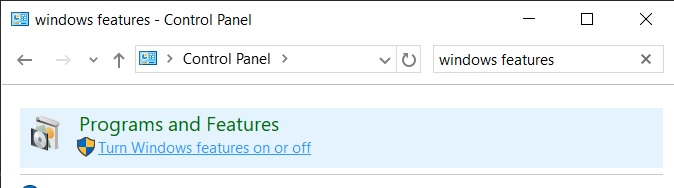

	4. Check the box next to **Internet Information Services** and expand **World Wide Web Services** and **Application Development Features** menus. Check the box next to **WebSocket Protocol**

	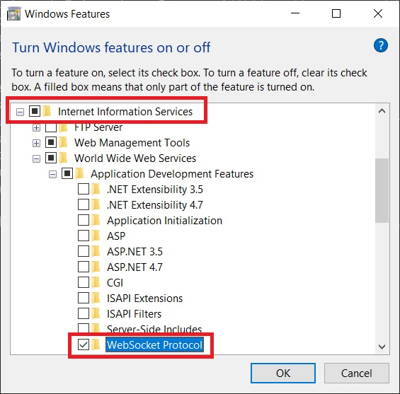

	5. Navigate to http://localhost/ in a browser. You should see the default Windows IIS landing page. **If you do not see the default landing page**
		1. Open **Control Panel**
		2. In the search box type **services**
		3. Under **Administrative Tools** click **View local services**
		4. Scroll down the list of services until you find **World Wide Web Publishing Service**
		5. Ensure the service is running, if not right click and select **Start**
2. Install URL Rewrite and Application Request Routing modules
	1. From the **Windows start menu**, search for **IIS Manager**
	2. In **IIS Manager**, click the **Web Platform Installer** icon

	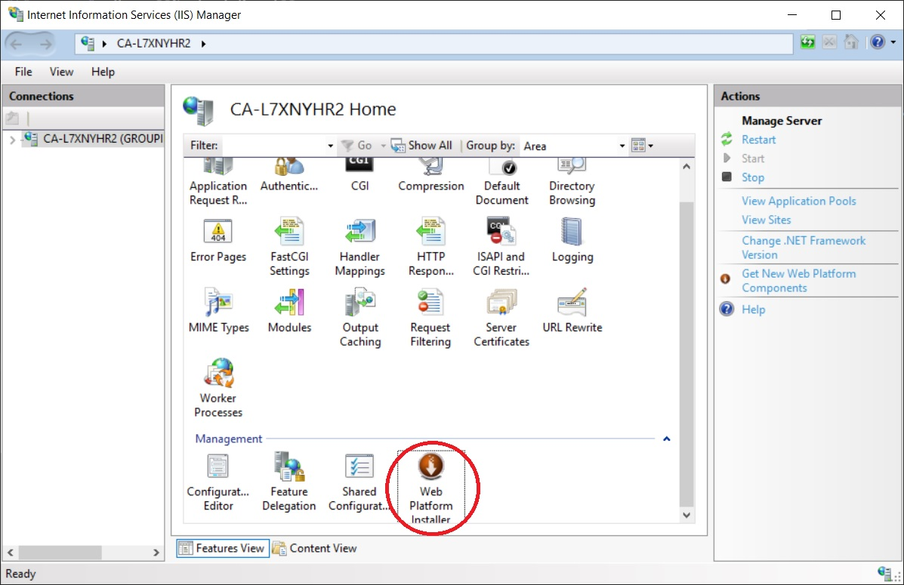

	3. Search for **url rewrite**
	4. Click **Add** next to **URL Rewrite 2.1**
	5. Search for **application request routing**
	6. Click **Add** next to **Application Request Routing 2.5 with KB2589179**
	7. **If you do not see the Web Platform Installer icon**
		1. Download and install **URL Rewrite** and **Application Request Routing** from the following links:
			1. https://www.iis.net/downloads/microsoft/url-rewrite
			2. https://www.iis.net/downloads/microsoft/application-request-routing

#### <a id="CreateReverseProxy">Creating the Reverse Proxy</a>
With the prerequisite installation complete we can create the reverse proxy that will forward requests to our Jupyter server. We'll do this by configuring our proxy as a **sub-application** of the default IIS website. The main advantage here is that we'll be able to access KEEP Training from the same hostname as the default website.
1. Enable proxy settings
	1. In **IIS Manager**, click the **Application Request Routing** icon

	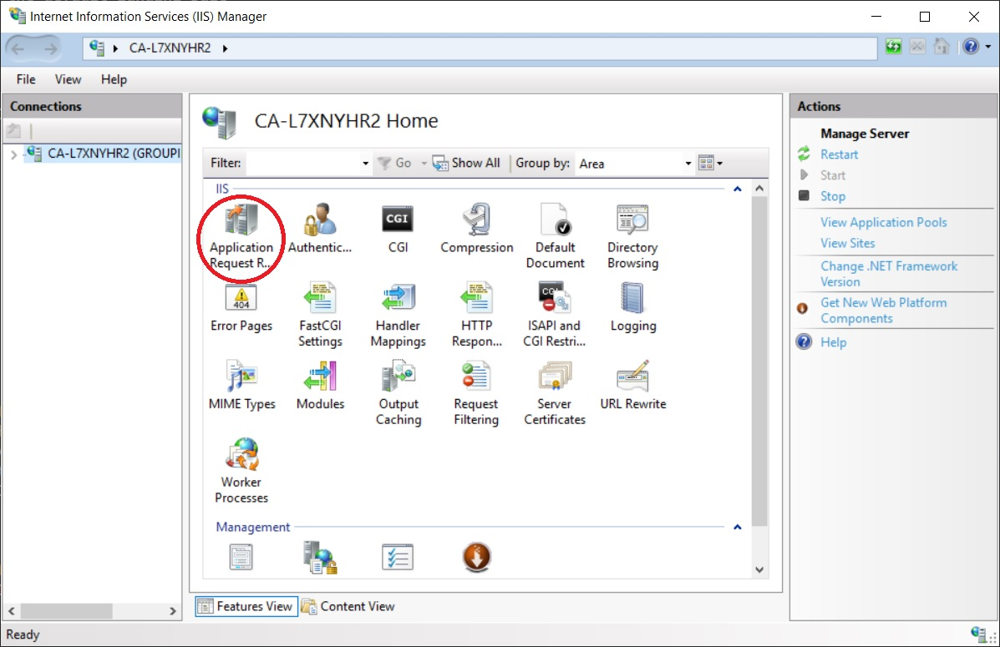

	2. In the right-side **Actions** menu, click **Server Proxy Settings...**
	3. Check the box for **Enabled Proxy**, you can leave the other settings as their defaults

	

2. Add a sub-application to the default website
	1. In the left-side **Connections** menu, expand the **server** and the **Sites** folder
	2. Right-click the **Default Web Site** and select **Add Application**

	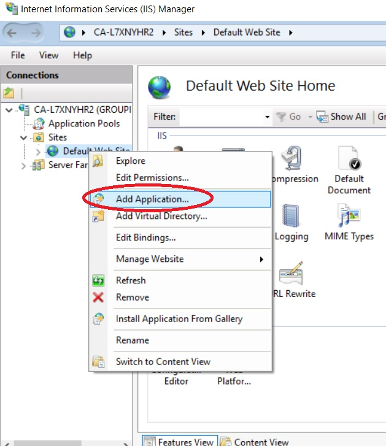

	3. In the **Add Application** screen, enter `KEEPTraining` as the **Alias**
	4. Since we will be configuring a reverse proxy, the **Physical path:** doesn't really matter, in our case we'll set it to the **root** directory that we created during installation.

	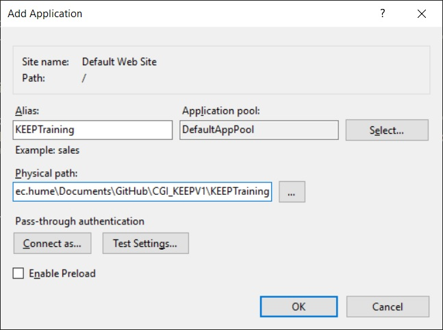

	5. Click **OK**, you should now see the new **sub-application** in the left-side **Connections** menu

	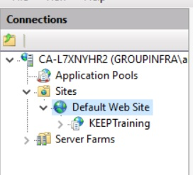

3. Configure the URL Rewrite settings
	1. Select the new **sub-application** you created in the previous step
	2. Click the **URL Rewrite** icon

	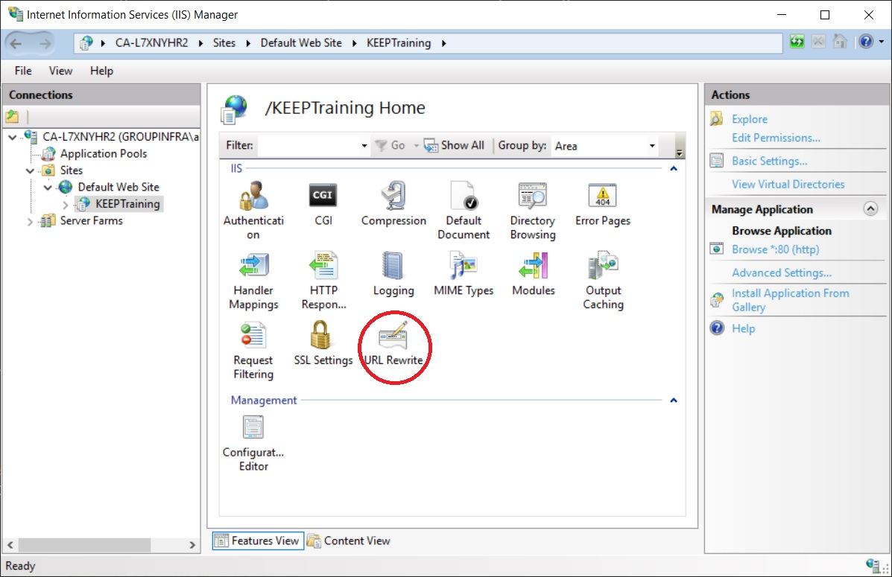

	3. In the right-side **Actions** menu, click **Add Rules(s)...**
	4. Select **Blank rule** under the **Inbound rules** section

	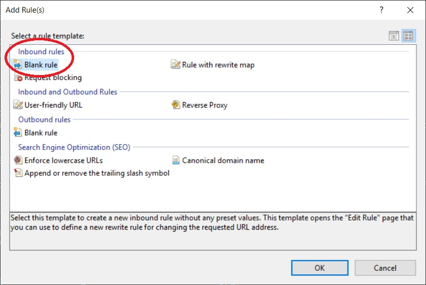

	5. Enter `Jupyter Reverse Proxy` in the **Name:** field
	6. Select `Matches the Pattern` in the **Requested URL:** field
	7. Select `Regular Expressions` in the **Using:** field
	8. Enter `(.*)` in the **Pattern:** field
	9. Check the box for **Ignore case**
	10. Expand the **Conditions** section
	11. Select `Match All` in the **Logical grouping:** field
	12. Click **Add...** inside the **Conditions** section
		1. Enter `{CACHE_URL}` in the **Condition input:** field
		2. Select `Matches the Pattern` in the **Check if input string:** field
		3. Enter `^(https?)://` in the **Pattern** field
		4. Check the box for **Ignore case**
		5. Click **OK**

		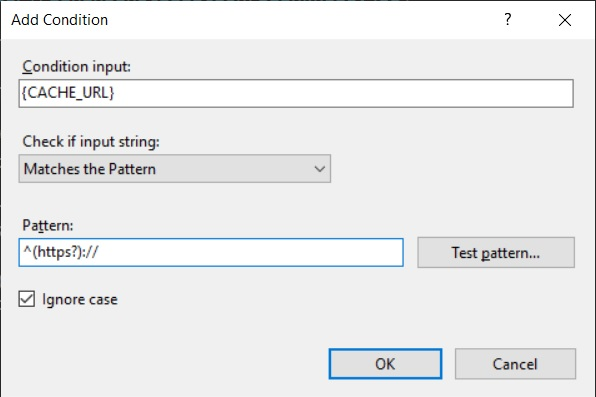

	13. Scroll down to the **Action** section
	14. Select `Rewrite` in the **Action type:** field
	15. Enter `{C:1}://localhost:85/keeptraining/{R:1}` in the **Rewrite URL:** field
	> Note: In our example case we are going to be using port 85, in reality you can use whatever port you want so long as you configure Jupyter to use the same port, which is covered in the Jupyter Configuration section of this guide.

	16. Check the box for **Append query string**
	17. Check the box for **Stop processing of subsequent rules**
	18. Your settings should now resemble the following:

	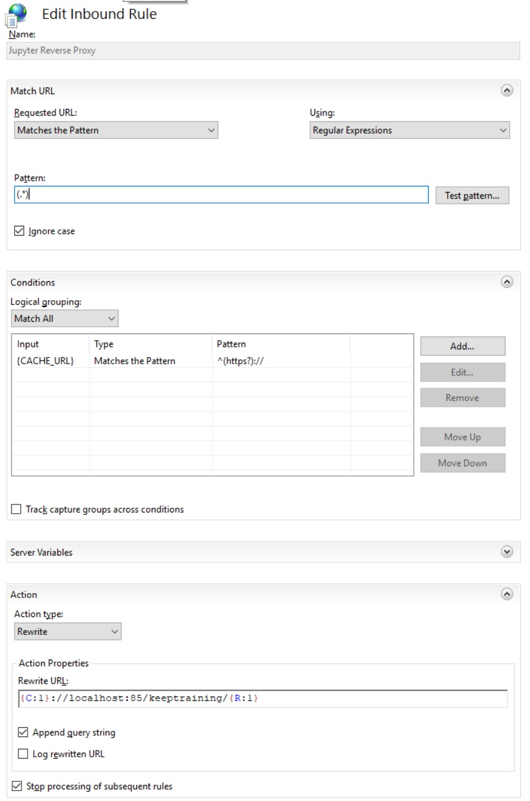

	19. In the right-side **Actions** menu, click **Apply**
	20. In the right-side **Actions** menu, click **Back to Rules**
	21. You should now see the rule you created in the **Inbound rules** section
	> Note: Take note of the contents of Input which should now read `URL path after '/KEEPTraining/'`. This is the information that needs to be added to the end of the default website hostname to access our sub-application. For example: http://localhost/KEEPTraining/

	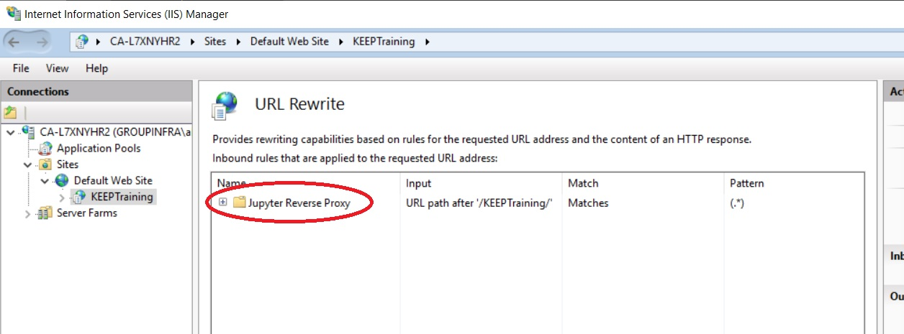

#### <a id="JupyterConfiguration">Jupyter Configuration</a>
The IIS specific configuration should now be complete. Next we need to configure Jupyter itself. First we will generate a configuration file and then make the necessary modifications.
1. Generate the configuration file
	1. Open your **command shell** and navigate to the inside of the **root** directory of the **KEEP Training** project
	2. Activate the **KEEP Training virtual environment**
	```
	.\KEEPTraining-env\Scripts\activate
	```
	3. Generate the jupyter configuration file using the following command
	```
	jupyter notebook --generate-config
	```
	4. Once Jupyter has finished generating the configuration it will display the location where it has been stored, navigate to this location and open the **jupyter_notebook_config.py** file
	> Note: If you created a password during installation, this folder will also contain a jupyter_notebook_config.json file. This file stores the hashed password and should not be confused with the main config file which ends with .py

	5. Next you will need to find and modify several configuration settings. For each setting you will need to **un-comment** the line first, before making changes. **Hint: using the search function of your text editor will make this much easier**
	6. Find each setting listed under the **Setting** heading of the following table and change the argument to match whatever is under the **Arugment** heading.
	> Note: The argument is everything after the "="" sign

	**Mandatory Settings**

	| Setting                                       | Arugment                          |
	| --------------------------------------------- | ----------------------------------|
	| c.NotebookApp.allow_origin = ''               | = '\*'                            |
	| c.NotebookApp.base_url = '/'                  | = '/keeptraining'                 |
	| c.NotebookApp.disable_check_xsrf = False      | = True                            |
	| c.NotebookApp.port = 8888                     | = 85                              |

	**Optional Settings**

	| Setting                                       | Arugment                          |
	| --------------------------------------------- | ----------------------------------|
	| c.NotebookApp.notebook_dir = ''               | = 'Full path to Notebooks folder' |
	| c.NotebookApp.open_browser = True             | = False                           |
	| c.NotebookApp.quit_button = True              | = False                           |
	| c.NotebookApp.terminals_enabled = True        | = False                           |

	<dl>
		<dt>c.NotebookApp.allow_origin</dt>
		<dd>Because we are using a reverse proxy, the origin of our requests is not always what Jupyter expects. By setting the allowed origins to an asterisk `*` we can prevent errors due to mis-matched origins.</dd>
		<dt>c.NotebookApp.base_url</dt>
		<dd>The base url adds whatever we specify to the URL address bar in our browser. Since we configured Jupyter to run as a sub-application the argument here needs to match whatever **Alias** we used when creating the sub-application. Failure to do so results in 404 errors during request routing.</dd>
		<dt>c.NotebookApp.disable_check_xsrf</dt>
		<dd>New versions of Jupyter include cross-site request forgeries protection, when using a reverse proxy we need to disable this to allow our kernals to start. This is due to a similar reason as the allow_origin setting.</dd>
		<dt>c.NotebookApp.notebook_dir</dt>
		<dd>Specifies the full path to the main startup directory for the Jupyter application. This should be set to our Notebook directory we created during installation, located within the root of the KEEP Training project.</dd>
		<dt>c.NotebookApp.open_browser</dt>
		<dd>Specifies whether or not to open a browser automatically when the server first starts. Since we intend to serve our Jupyter application remotely and not locally, this is not necessary.</dd>
		<dt>c.NotebookApp.port</dt>
		<dd>Specifies the port that Jupyter will listen on. This should match whatever port we chose during URL Rewrite configuration.</dd>
		<dt>c.NotebookApp.quit_button</dt>
		<dd>Allows us to enable or disable the Quit button on the Jupyter browser UI. If left enabled, a user could shut the Jupyter server down completely from the UI.</dd>
		<dt>c.NotebookApp.terminals_enabled</dt>
		<dd>By default Jupyter allows the use of in-browser terminals. This setting simply disables that functionality, this does not make the server more secure, since everything that could otherwise be done in a terminal can be done in a notebook.</dd>
	</dl>

	For more detailed information about Jupyter configuration settings, refer to the [official documentation](https://jupyter-notebook.readthedocs.io/en/stable/config.html)

	7. Return to your **command shell** and navigate to the inside of the **Notebooks** folder located in the **root** of the **KEEP Training** project
	```
	cd Notebooks
	```
	8. Start the Jupyter server
	> Note: If you set the optional notebook_dir setting, you do not need to navigate into the Notebooks folder. You may start the Jupyter server from any location
	```
	jupyter notebook
	```
	9. Navigate to http://localhost/keeptraining/ in your browser. Replace /keeptraining/ with whatever you chose as an **Alias** during the creation of the sub-application
	10. You should be automatically redirected to the Jupyter browser tree

	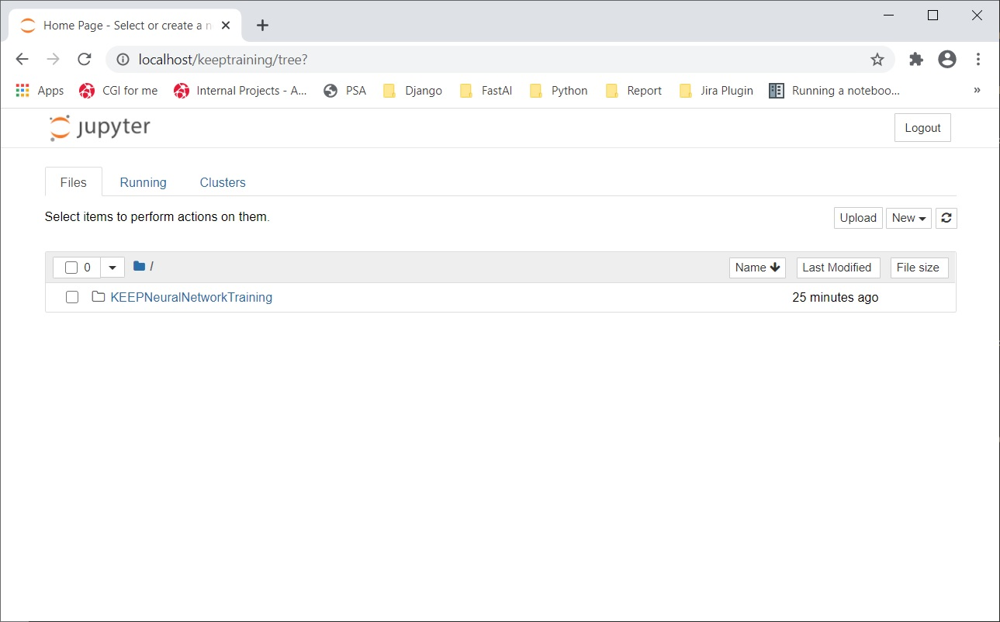

	11. KEEP Training is now successfully installed and hosted with IIS. Refer to the [KEEP Training Operation Manual](https://github.com/alechume/CGI_KEEPV1/blob/main/Documentation/KEEPTrainingOperationManual.md) for how to create and run notebooks in Jupyter