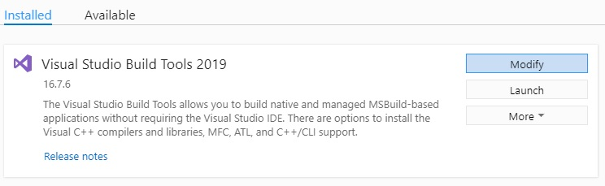
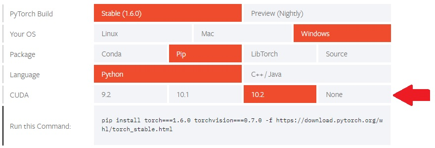
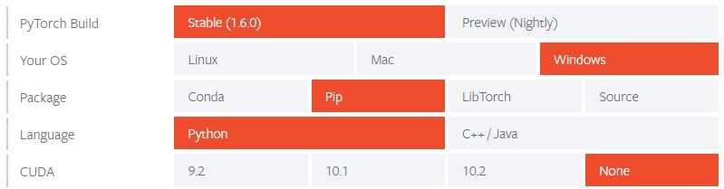

# KEEP Training Installation
### Table of Contents
1. [Introduction](#Introduction)
2. [Software Prerequisites](#SoftwarePrerequisites)
3. [Package Versions](#PackageVersions)
4. [Prerequisite Installation](#PrerequisiteInstallation)
5. [Installation From Scratch](#InstallFromScratch)
6. [Installation From Repository](#InstallFromRepository)
7. [How to Install Pytorch](#InstallPytorch)

### <a id="Introduction">Introduction</a>
Below you will find the instructions on the installation of the Jupyter Notebook application responsible for training the neural network model used within KEEP. For the purpose of this tutorial all software and package prerequisites will be listed, and it will be assumed you are using the same versions. You may attempt installation using differing versions, but results may vary.

For many of the installation steps you should be familiar with using a command shell (CMD, PowerShell, Bash or equivalent).

### <a id="SoftwarePrerequisites">Software Prerequisites</a>
1. [Python](https://www.python.org/downloads/) = 3.8.5
2. [Visual Studio Build Tools 2019](https://visualstudio.microsoft.com/downloads/) (C++ Build Tools)

### <a id="PackageVersions">Package Versions</a>
1. [Virtualenv](https://pypi.org/project/virtualenv/) = 20.0.31 (Allows the creation of python virtual environments)
1. [Pytorch](https://pytorch.org/get-started/locally/) = 1.6.0 (Contains data structures for multi-dimensional tensors and mathematical operations)
2. [TorchVision](https://pytorch.org/get-started/locally/) = 0.7.0 (Package of commonly used datasets, model architectures and image transformations for computer vision)
3. [Fastai](https://fastai1.fast.ai/install.html) = 1.0.61 (Simplified API for Pytorch)
4. [SpaCy](https://spacy.io/) = 2.3.2 (Natural language processing software library)
5. [Scikit-learn](https://scikit-learn.org/stable/) = 0.23.2 (Machine learning software library)
6. [Pyodbc](https://pypi.org/project/pyodbc/) = 4.0.30 (Facilitates the access of ODBC databases)
7. [Xlrd](https://pypi.org/project/xlrd/) = 1.2.0 (Allows extraction of excel spreadsheet data)
8. [Jupyter](https://jupyter.org/) = 1.0.0 (Allows for the creation and sharing of documents that contain live code and markup)

### <a id="PrerequisiteInstallation">Prerequisite Installation</a>
1. Download and install `Python` (version 3.8.5), be sure to check your system information to determine if you need 64bit vs 32bit
	1. Go to https://www.python.org/downloads/
	2. Include pip during installation
	3. Add Python to your environment variables
	4. Type `python -V` in cmd prompt, powershell, bash shell or equivalent to verify Python installation

	```
	Python 3.8.5
	```
2. Download and install `Visual Studio Build Tools 2019 (C++ Build Tools)`
	1. Go to https://visualstudio.microsoft.com/downloads/
	2. Scroll down to **All Downloads**
	3. Click the dropdown for **Tools for Visual Studio 2019**
	4. Download **Build Tools for Visual Studio 2019**
	5. Run the build tools installer you just downloaded and follow the prompts until you reach the installation details screen
	> NOTE: If you have already installed Visual Studio build tools in the past, you will first need to click **Modify** when you reach the **Installed** screen 
	6. Check the box for **C++ build tools**, all other options can remain default.
	
	7. Click install
3. With the prerequisite installation complete, you on move on to installing KEEP Training via one of the following methods:
	* [Installation From Scratch](#InstallFromScratch)
	* [Installation From Repository](#InstallFromRepository)

### <a id="InstallFromScratch">Installation From Scratch</a>
1. Begin with the [Prerequisite Installation](#PrerequisiteInstallation)
2. Create a folder to act as the root directory for KEEP and navigate to this folder in your shell
> Note: Ensure your shell is running in administrator mode or equivalent
```
cd path/to/folder
```
3. Install `virtualenv` using pip
```
pip install virtualenv
```
4. Create a `virtual python environment` to contain Python dependancies using the following command
> Note: A `virtual python environment` allows us to keep all our installed packages and dependancies local to the project we're working on, effectively allowing us to install different versions of packages for different projects without interference.
```
virtualenv ENVName-env (Replace ENVName-env with anything you'd like)
```
5. Activate the virtual environment you just created in order to start installing required packages
> Note: You will need to activate this virtual environment every time you want to work with this project from the cmd line or shell, you can deactive the environment when finished with the `deactivate` command.
```
.\ENVName-env\Scripts\activate
```
The output in the shell windows should now be prefaced with the environment name in brackets:
```
(ENVName-env) C:\Some\path>
```
6. Before we begin installing the required packages we need to upgrade the pip installer with the following command
```
python -m pip install --upgrade pip
```
7. Now we are ready to begin installing our required packages. First we'll install Pytorch
> Please refer to the [How to Install Pytorch](#InstallPytorch) section of this installation guide for details
8. Verify Pytorch installation by first entering a Python shell using the following command
```
python
```
and run the following commands
```
>>> from __future__ import print_function
>>> import torch
>>> x = torch.rand(5, 3)
>>> print(x)
```
The output should look similar to the follow:
```
tensor([[0.3380, 0.3845, 0.3217],
        [0.8337, 0.9050, 0.2650],
        [0.2979, 0.7141, 0.9069],
        [0.1449, 0.1132, 0.1375],
        [0.4675, 0.3947, 0.1426]])
```
Additionally, if you installed Pytorch with CUDA, you can check if your GPU driver and CUDA are installed and accessible using the following command, which should return `True`. **If you chose not to install Pytorch with CUDA, skip this step.**
```
torch.cuda.is_available()
```
Once verified we can exit our Python shell
```
>>> exit()
```
9. Install Fastai 1.0.61 **(with your python virtual environment activated)**
```
pip install fastai==1.0.61
```
10. Install SpaCy 2.3.2 **(with your python virtual environment activated)**
```
pip install spacy==2.3.2
```
11. Install Scikit-learn 0.23.2 **(with your python virtual environment activated)**
```
pip install scikit-learn==0.23.2
```
12. Install Pyodbc 4.0.30 **(with your python virtual environment activated)**
```
pip install pyodbc==4.0.30
```
13. Install Xlrd 1.2.0 **(with your python virtual environment activated)**
```
pip install xlrd==1.2.0
```
14. Install Jupyter 1.0.0 **(with your python virtual environment activated)**
```
pip install jupyter==1.0.0
```
15. Start jupyter server to verify installation
```
jupyter notebook
```
After running this command you should be redirected to a browser window automatically displaying the main jupyter homepage.
16. KEEP Training is now successfully installed. For instruction on how to create and run notebooks in Jupyter refer to the [KEEP Training Operation Manual](https://github.com/alechume/CGI_KEEPV1/blob/main/Documentation/KEEPTrainingOperationManual.md)

### <a id="InstallFromRepository">Installation From Repository</a>
1. Begin with the [Prerequisite Installation](#PrerequisiteInstallation)
2. Clone the repository to your local environment and navigate to the `KEEPTraining` folder via your shell
> Note: Ensure your shell is running in administrator mode or equivalent
```
cd path/to/folder/KEEPTraining/
```
3. Install `virtualenv` using pip
```
pip install virtualenv
```
4. Create a `virtual python environment` to contain Python dependancies using the following command
> Note: A `virtual python environment` allows us to keep all our installed packages and dependancies local to the project we're working on, effectively allowing us to install different versions of packages for different projects without interference.
```
virtualenv ENVName-env (Replace ENVName-env with anything you'd like)
```
5. Activate the virtual environment you just created in order to start installing required packages
> Note: You will need to activate this virtual environment every time you want to work with this project from the cmd line or shell, you can deactive the environment when finished with the `deactivate` command.
```
.\ENVName-env\Scripts\activate
```
The output in the shell windows should now be prefaced with the environment name in brackets:
```
(ENVName-env) C:\Some\path>
```
6. Before we begin installing the required packages we need to upgrade the pip installer with the following command
```
python -m pip install --upgrade pip
```
7. Now we are ready to begin installing our required packages. First we'll install Pytorch
> Please refer to the [How to Install Pytorch](#InstallPytorch) section of this installation guide for details
8. Verify Pytorch installation by first entering a Python shell using the following command
```
python
```
and run the following commands
```
>>> from __future__ import print_function
>>> import torch
>>> x = torch.rand(5, 3)
>>> print(x)
```
The output should look similar to the follow:
```
tensor([[0.3380, 0.3845, 0.3217],
        [0.8337, 0.9050, 0.2650],
        [0.2979, 0.7141, 0.9069],
        [0.1449, 0.1132, 0.1375],
        [0.4675, 0.3947, 0.1426]])
```
Additionally, if you installed Pytorch with CUDA, you can check your GPU driver and CUDA are installed and accessible by Pytorch using the following command, which should return `True`. **If you chose not to install Pytorch with CUDA, skip this step.**
```
torch.cuda.is_available()
```
Once verified we can exit our Python shell
```
>>> exit()
```
9. Install the remaining packages using the included `requirements.txt` file
> Note: you will need to navigate to the same directory as the requirements file, or specify the exact location. The requirements file is located in the `KEEPTraining` folder of the repository
```
pip install -r requirements.txt
```
10. Start jupyter server to verify installation
```
jupyter notebook
```
After running this command you should be redirected to a browser window automatically displaying the main jupyter homepage.
11. KEEP Training is now successfully installed. For instruction on how to create and run notebooks in Jupyter refer to the [KEEP Training Operation Manual](https://github.com/alechume/CGI_KEEPV1/blob/main/Documentation/KEEPTrainingOperationManual.md)

### <a id="InstallPytorch">How to Install Pytorch</a>
For Pytorch installation with CUDA, you will be required to know which model of GPU the machine or server running KEEP has. If you are unsure, or do not have a CUDA capable GPU you may skip to step 3.
1. Determine if you have a CUDA capable GPU
	1. Navigate to https://developer.nvidia.com/cuda-gpus
	2. Scroll down and check the expandable tables for your specific GPU model
	3. Make note of the **Compute Capability** number next to your GPU model
	4. If you determine you do not have a CUDA capable GPU, skip to step 3
2. Determine which CUDA SDK to use
	1. Navigate to https://pytorch.org/get-started/locally/
	2. Make note of the Pytorch supported CUDA SDK's
	
	3. Navigate to https://en.wikipedia.org/wiki/CUDA#GPUs_supported
	4. Find the Pytorch supported SDK's in the list and cross-reference with the **Compute Capability** number from step 1 to determine which SDK to use, generally the higher the SDK the better
	> NOTE: This guide was tested using CUDA SDK 10.2, with Pytorch version 1.6.0
	5. Navigate to https://developer.nvidia.com/cuda-toolkit-archive and download and install the CUDA Toolkit with the matching number of the SDK you just determined, for example, if you determined you need to use CUDA SDK 10.2, download CUDA Toolkit 10.2. When downloading choose **exe (local)**.
3. Install Pytorch
	1. Navigate to https://pytorch.org/get-started/locally/
	2. Select the following options:
		1. Pytorch Build: Stable
		2. Your OS: What operating system KEEP will be running on
		3. Package: Pip
		4. Language: Python
		5. CUDA: The SDK number you determined in step 2, or None
		
	3. Copy the output from **Run this Command** and run the command in your shell **while the virtual environment is activated**
	> NOTE: If you get an error during the running of this command about SSL certificates, you can modify the command to use Amazon AWS instead and try again. For example: 
	> * `pip install torch==1.6.0+cpu torchvision==0.7.0+cpu -f https://download.pytorch.org/whl/torch_stable.html`
	<br>
	would become: 
	> * `pip install torch==1.6.0+cpu torchvision==0.7.0+cpu -f https://s3.amazonaws.com/pytorch/whl/torch_stable.html`
