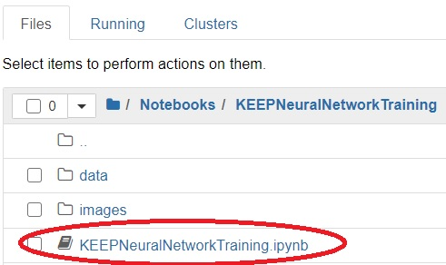
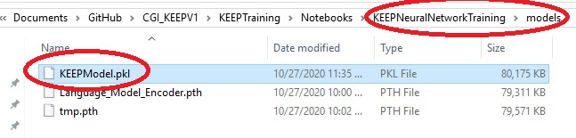

# KEEP Training Operation Manual
### Table of Contents
1. [Introduction](#Introduction)
2. [Environment Prerequisites](#EnvironmentPrerequisites)
3. [Creating Your First Notebook](#CreateFirstNotebook)
4. [Using an Existing Notebook](#UseExistingNotebook)
5. [Re-training the KEEP Neural Network Model](#RetrainKEEPModel)
	1. [Prerequisites](#KEEPPrerequisites)
	2. [Setting Up Your Environment](#KEEPEnvironmentSetup)
	3. [Running the KEEP Notebook](#RunningKEEPNotebook)

### <a id="Introduction">Introduction</a>
Below you will find instructions on the basic operation of KEEP Training. This is **NOT** the place to find an in-depth explanation of machine learning concepts, or how to correctly build custom neural network models. This manual is only meant to address the basic operation of KEEP Training to get you started.

Jupyter is a software package that allows developers to both write code and see their results on the same page. In our case it allows us to write and run Python code to train our models and combine it with Markdown, a type of light-weight text formatting language. Through Jupyter we can write the code required to train our model and see a visual representation of the output in real time. Training neural network models is complex and requires experimentation, Jupyter allows us to keep everything in one place.

### <a id="EnvironmentPrerequisites">Environment Prerequisites</a>
1. Complete [KEEP Training installation](https://github.com/alechume/CGI_KEEPV1/blob/main/Documentation/KEEPTrainingInstallation.md)
2. The Jupyter Notebook server is running

### <a id="CreateFirstNotebook">Creating Your First Notebook</a>
1. From the Jupyter browser window, select `Python 3` from the <kbd>New</kbd> dropdown menu

2. Type `print('Hello World!')` in the first line or `cell` of the newly created `Python 3` notebook
3. With the first `cell` highlighted, press <kbd>Shift</kbd> + <kbd>Enter</kbd> or press the <kbd>Run</kbd> button at the top of the page

4. In the second line of the notebook type `# This is a title!` and with the `cell` still highlighted, select `Markdown` from the **dropdown menu** near the top of the page
5. With the second `cell` highlighted, press <kbd>Shift</kbd> + <kbd>Enter</kbd> or press the <kbd>Run</kbd> button at the top of the page

6. Congratulations! You have successfully created and ran your first notebook with `Python` code and `Markdown`. To edit the second `cell` with our title, simply double click on `cell`
> Note: Just like when you're writing Python scripts, you can import different packages as needed. For example `import fastai.vision.all import *` will import all of the fastai libraries associated with computer vision
7. You can rename your notebook by clicking on the document name near the top of the window

### <a id="UseExistingNotebook">Using an Existing Notebook</a>
> Note: You will need to have a Notebook `.ipynb` file, and know where it is stored
1. From the Jupyter browser window, navigate to the location of the notebook `.ipynb` file you want to run and click on it
2. If you would like to re-run the notebook, click the button with the double arrows and click <kbd>Restart and Run All Cells</kbd>

3. To run individual `cells`, highlight the `cell` by clicking on it and press <kbd>Shift</kbd> + <kbd>Enter</kbd> or press the <kbd>Run</kbd> button at the top of the page
> Note: When you run a notebook, Jupyter will automatically save the output, therefore just because you see output from previous cells, you may not have access to their variables until you re-run the preceding cells. For example, if in cell 1 I have `x = 10` and in cell 2 I have `print(x)`, cell 2 will fail until I run cell 1 first.

### <a id="RetrainKEEPModel">Re-training the KEEP Neural Network Model</a>
Start by reading through [Creating Your First Notebook](#CreateFirstNotebook) and [Using an Existing Notebook](#UseExistingNotebook)

#### <a id="KEEPPrerequisites">Prerequisites</a>
In order to re-train the KEEP neural network model, you will need to gather 4 things:
1. The `KEEPNeuralNetworkTraining.ipynb` notebook file
2. The `data` folder containing the `labelled.xlsx` file, which contains the labelled dataset
3. The `images` folder, which contains various images used by the notebook file
4. The **connection string and credentials** for the **Jira database**

#### <a id="KEEPEnvironmentSetup">Setting Up Your Environment</a>
If you followed through with the [KEEP Training installation](https://github.com/alechume/CGI_KEEPV1/blob/main/Documentation/KEEPTrainingInstallation.md) guide, you should now have a **Notebooks** folder located in the **root** of the **KEEP Training** project. We will be using that location to store all of our notebook files.
1. Create a new folder inside the Notebooks folder named `KEEPNeuralNetworkTraining`
2. Copy the `KEEPNeuralNetworkTraining.ipynb`, `data` and `images` folders and files into this new folder

#### <a id="RunningKEEPNotebook">Running the KEEP Notebook</a>
1. In the Jupyter browser window, you should now see a new folder named `KEEPNeuralNetworkTraining`, open the folder by clicking on it

2. Inside the `KEEPNeuralNetworkTraining` folder you should see the `data` folder, the `images` folder and the `ipynb` file

3. Click on the `KEEPNeuralNetworkTraining.ipynb` file to open it

4. Change the **Connection String** and **Query** to match your own Jira database connection string and credentials.

5. You can now re-run the notebook by clicking the button with the double arrows and clicking <kbd>Restart and Run All Cells</kbd>
> Note: Training neural network models can take a significant amount of time and system resources. It is recommended that you do NOT attempt to train models on business-critical systems or servers.

6. You can monitor the progress of your notebook in real-time. For each `cell` containing code, Jupyter will display an `*` or a number indicating if it is processing or completed. For example, in the image below we can see that the `cell` containing `learn.unfreeze()` has completed, indicated by the number 11, and that the next `cell` with `learn.fit_one_cycle(...)` is currently being processed.

7. When the notebook has finished running, Jupyter will automatically create a new folder named `models` located in the same directory as the `ipynb` file
> Note: The main model responsible for performing predictions is the `KEEPModel.pkl`

8. When you've finished running the notebook, it is always a good idea to ensure you shut it down to free up system resources. You can do this by returning to the Jupyter browser window, checking the box next to the running notebook, and clicking the <kbd>Shutdown</kbd> button

9. For a more detailed explanation of how the KEEP neural network model was trained, see the details provided in the notebook itself
