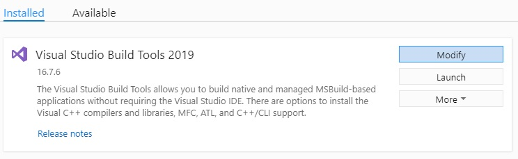
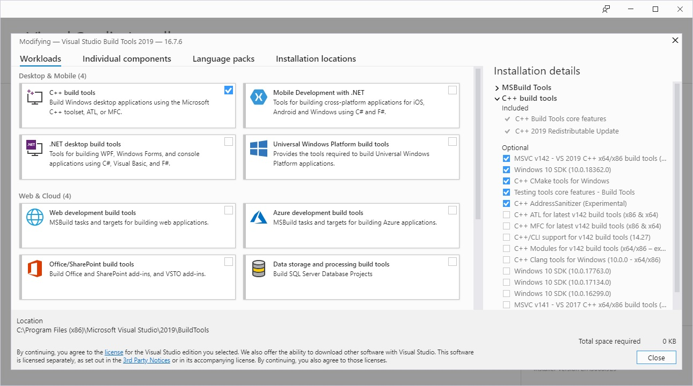

# Prerequisite Installation
1. Download and install `Python` (version 3.8.5), be sure to check your system information to determine if you need 64bit vs 32bit
	1. Go to https://www.python.org/downloads/
	2. Include pip during installation
	3. Add Python to your environment variables
	4. Type `python -V` in cmd prompt, powershell, bash shell or equivalent to verify Python installation

	```
	Python 3.8.5
	```
2. Download and install `Visual Studio Build Tools 2019 (C++ Build Tools)`
	1. Go to https://visualstudio.microsoft.com/downloads/
	2. Scroll down to **All Downloads**
	3. Click the dropdown for **Tools for Visual Studio 2019**
	4. Download **Build Tools for Visual Studio 2019**
	5. Run the build tools installer you just downloaded and follow the prompts until you reach the installation details screen
	> Note: If you have already installed Visual Studio build tools in the past, you will first need to click **Modify** when you reach the **Installed** screen 
	> 
	> 
	
	6. Check the box for **C++ build tools**, all other options can remain default.
	
	
	
	7. Click install
